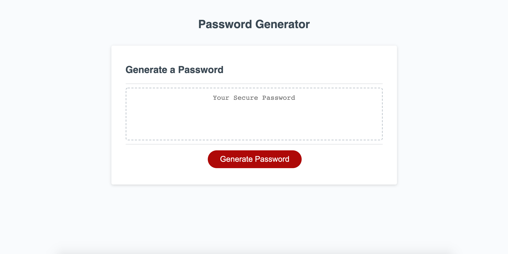

# Password Generator

For this project, I was required to create a password generator using JavaScript. The user is asked how many characters they would like to include and it must be between 8 and 128 characters. After the length of the password is determined, the user is asked if they would like to include lower case letters, upper case letters, numbers and special characters.

# Link to Project:
https://jessm91.github.io/friendly-parakeet/

